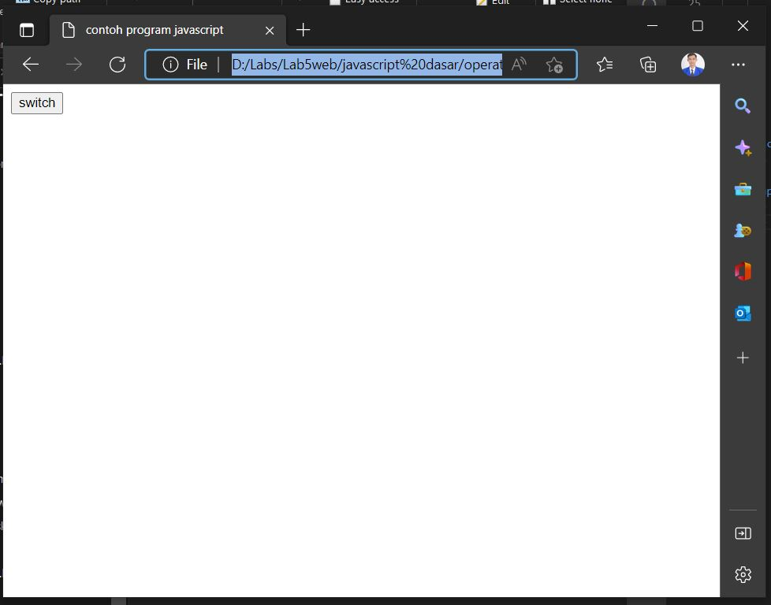

# Lab5web
## PRAKTIKUM 5: JAVASCRIPT

1. contoh document.write dan console.log
    * 
2. Pemakaian alert dan property window
    * 
3. Pemakain Method
    * 
4. Pemakaian Prompt
    * 
    * 
5. Pembuatan fungsi dan cara pemanggilan
    * 
6. Operasi dasar aritmatika
    * 
    * 
7. Kondisi If Else
    * 
    * 
8. Penggunaan operator switch unutk seleksi kondisi
    * 
    * 
9. Form inputan
    * 
10. Form Button
    * 
11. Pilihan menggunakan checkbox dengan perhitungan otomatis
    * 

## Script untuk melakukan validasi pada isian form

* 